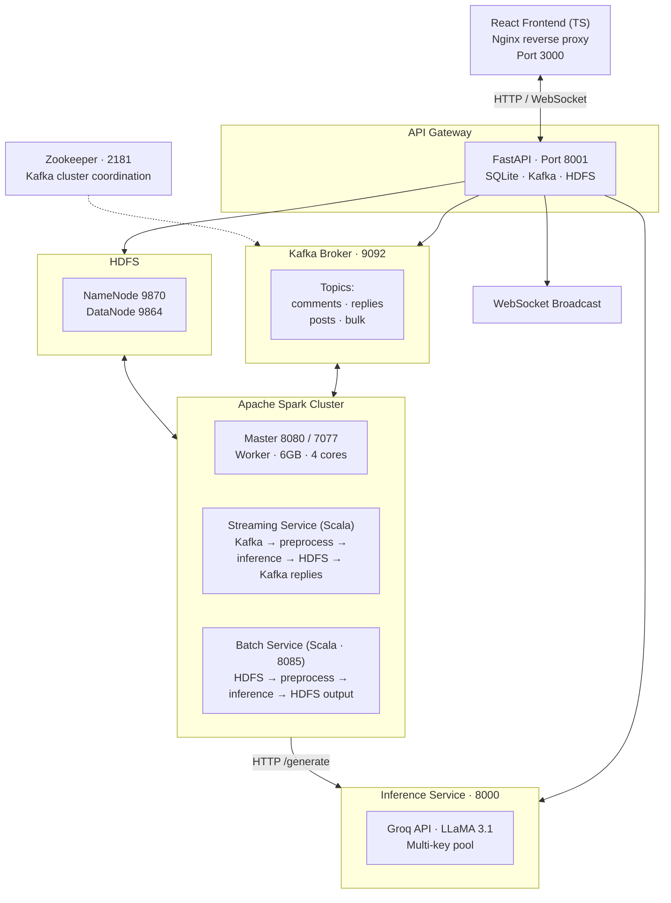
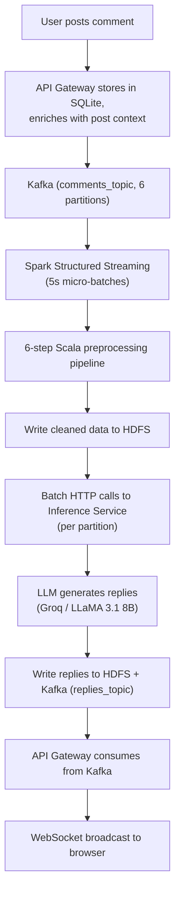
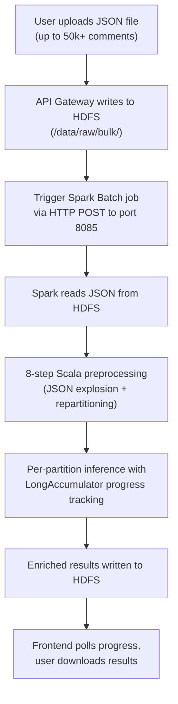

# RedditAI - Big Data AI Reply Generation Platform

A distributed system that generates AI-powered replies to social media comments in real time. Built on a full big data stack: **Kafka** for event streaming, **Spark** (Scala) for preprocessing, **HDFS** for distributed storage, and **Groq LLMs** for inference. Supports both real-time streaming and batch processing of up to 50k+ records.

---
## Architecture

### System Overview



### Streaming Pipeline



### Batch Pipeline


---

## Tech Stack

| Layer | Technology |
|---|---|
| Frontend | React 18, TypeScript, Vite, Nginx |
| API Gateway | Python 3.11, FastAPI, aiokafka, SQLite (WAL mode) |
| Stream Processing | Apache Spark 3.5 Structured Streaming (Scala 2.12) |
| Batch Processing | Apache Spark 3.5 (Scala 2.12), embedded HTTP server |
| Message Queue | Apache Kafka 7.5 (Confluent), 6 partitions/topic |
| Coordination | Apache Zookeeper 7.5 |
| Distributed Storage | Hadoop HDFS 3.2.1 (NameNode + DataNode) |
| LLM Inference | Python, Groq API (LLaMA 3.1 8B Instant), multi-key pool |
| Vision Model | LLaMA 4 Scout 17B (image captioning via Groq) |
| Build (Scala) | SBT 1.9.7 |
| Containerization | Docker, Docker Compose (14 services) |

---

## Project Structure

```
Reddit-AI-Reply-Generator/
|
+-- infrastructure/
|   +-- docker-compose.yml           # All service definitions
|   +-- hadoop/
|   |   +-- core-site.xml
|   |   +-- hdfs-site.xml
|   +-- kafka/
|   |   +-- server.properties
|   +-- ngrok/
|       +-- ngrok.yml                # Tunnel config for public access
|
+-- services/
|   +-- api-gateway/                 # Python FastAPI gateway
|   |   +-- app/main.py              # REST API, Kafka, WebSocket, HDFS client
|   |   +-- Dockerfile
|   |   +-- requirements.txt
|   |
|   +-- inference-service/           # Python LLM inference
|   |   +-- app/main.py              # Multi-key pool, batching, rate limiting
|   |   +-- Dockerfile
|   |   +-- requirements.txt
|   |
|   +-- spark-streaming-scala/       # Spark Structured Streaming
|   |   +-- src/main/scala/com/reddit/streaming/
|   |   |   +-- StreamingApp.scala
|   |   |   +-- PreprocessingEngine.scala
|   |   |   +-- InferenceClient.scala
|   |   |   +-- Models.scala
|   |   +-- build.sbt
|   |   +-- Dockerfile
|   |
|   +-- spark-batch-scala/           # Spark Batch processing
|   |   +-- src/main/scala/com/reddit/batch/
|   |   |   +-- BatchApp.scala
|   |   |   +-- BatchPreprocessingEngine.scala
|   |   |   +-- BatchInferenceClient.scala
|   |   |   +-- Models.scala
|   |   +-- build.sbt
|   |   +-- Dockerfile
|   |
|   +-- frontend/                    # React + TypeScript UI
|       +-- src/App.tsx              # Main SPA (feed + batch views)
|       +-- src/index.css            # Dark theme
|       +-- nginx.conf               # Reverse proxy for API + WebSocket
|       +-- Dockerfile
|       +-- package.json
|
+-- scripts/
|   +-- generate_bulk_data.py        # Generate test JSON datasets
|   +-- simulate_velocity.py         # Load test: high-rate comment simulation
|   +-- start-ngrok.bat              # Windows ngrok launcher
|   +-- start-ngrok.sh               # Linux/Mac ngrok launcher
|
+-- .gitignore
+-- README.md
```

---

## Getting Started

### Prerequisites

- **Docker** and **Docker Compose**
- **Groq API key(s)** - get free keys at [console.groq.com](https://console.groq.com)

### 1. Clone and configure

```bash
git clone https://github.com/your-username/Reddit-AI-Reply-Generator.git
cd Reddit-AI-Reply-Generator
```

Create an `.env` file inside `infrastructure/`:

```env
LLM_PROVIDER=groq
GROQ_API_KEYS=key1,key2,key3
# Optional: single key fallback
GROQ_API_KEY=your_single_key
# Optional: for ngrok tunneling
NGROK_AUTHTOKEN=your_ngrok_token
```

### 2. Start all services

```bash
cd infrastructure
docker compose up --build
```

First build takes ~10 minutes (Scala SBT compilation). Subsequent starts are cached.

### 3. Access the application

| Service | URL |
|---|---|
| **Frontend** | http://localhost:3000 |
| API Gateway | http://localhost:8001 |
| Spark Master UI | http://localhost:8080 |
| Spark Streaming Driver UI | http://localhost:4040 |
| Spark Batch Driver UI | http://localhost:4041 |
| HDFS NameNode UI | http://localhost:9870 |
| Spark Batch HTTP API | http://localhost:8085 |

### 4. Use the app

1. Open http://localhost:3000 and enter any username (no password needed)
2. The feed shows seed posts across subreddits (programming, space, gaming, etc.)
3. Post a comment on any post -- an AI reply arrives via WebSocket within ~10-15 seconds
4. Switch to **Batch Upload** tab to process bulk JSON files

---

## Key Optimizations

### Multi-Comment Batching (10x fewer API calls)

Up to 10 comments are packed into a single LLM request. Comments on the same post share context; singleton comments from different posts are grouped into mixed-batch prompts.

```
Without batching: 50 comments -> 50 API calls -> ~107s
With batching:    50 comments ->  5 API calls -> ~11s
```

### Multi-Key API Pooling (Nx throughput)

Round-robin across multiple Groq API keys, each with independent sliding-window rate limiters (28 RPM per key). With 3 keys: 84 RPM total.

### Broadcast Join Optimization

Post metadata is collected to the Spark driver and broadcast to all executors via `SparkContext.broadcast()`, avoiding costly distributed DataFrame lookups inside `mapPartitionsWithIndex`.

### Dynamic Repartitioning

Batch jobs repartition based on `totalRecords / batchSize` for even workload distribution and granular progress tracking via `LongAccumulator`.

---

## Preprocessing Pipelines

### Streaming (6 steps, in Scala)

1. **Schema validation** - filter records missing required fields
2. **Text cleaning** - remove emojis, replace URLs with `[URL]`, strip special chars, normalize whitespace
3. **Null handling** - fill optional fields with defaults
4. **Deduplication** - drop duplicate `commentId`s within micro-batch
5. **Image metadata enrichment** - add `hasImage`/`hasCaption` flags
6. **Feature structuring** - add `wordCount`, `charCount`, `processedAt`, `isReply`

### Batch (8 steps, in Scala)

1. **JSON explosion** - flatten nested posts+comments into individual records (`explode_outer`)
2. **Schema validation** - filter records missing required fields
3. **Text cleaning** - same as streaming, plus `postTitle` cleaning
4. **Null handling** - fill optional fields with defaults
5. **Deduplication** - drop duplicate `commentId`s
6. **Image metadata enrichment** - add `hasImage`/`hasCaption` flags
7. **Feature structuring** - add `wordCount`, `charCount`, `processedAt`
8. **Intelligent repartitioning** - partition by `totalRecords / targetPartitionSize`

---

## HDFS Directory Layout

```
/data/
+-- raw/
|   +-- streaming/          # Raw Kafka data before preprocessing
|   +-- bulk/               # Uploaded bulk JSON files
+-- cleaned/
|   +-- streaming/          # Preprocessed streaming data
|   +-- bulk/               # Preprocessed bulk data
+-- replies/
|   +-- streaming/          # AI replies from streaming pipeline
|   +-- bulk/               # AI replies from batch pipeline
+-- uploads/                # General file uploads

/checkpoints/
+-- streaming/              # Spark Structured Streaming fault-tolerance
```

---

## Kafka Topics

| Topic | Partitions | Purpose |
|---|---|---|
| `comments_topic` | 6 | User comments enriched with post context |
| `replies_topic` | 6 | AI-generated replies from Spark back to API Gateway |
| `posts_topic` | 6 | Newly created posts |
| `bulk_topic` | 3 | Bulk operation notifications |

All topics have 7-day retention (168 hours).

---

## API Endpoints

| Method | Path | Auth | Description |
|---|---|---|---|
| POST | `/api/auth/login` | No | Login or register with username |
| GET | `/api/auth/me` | Yes | Get current user |
| GET | `/api/users` | No | List all users |
| GET | `/api/posts` | No | List all posts |
| GET | `/api/posts/:id` | No | Get single post |
| POST | `/api/posts` | Yes | Create post (optional image) |
| GET | `/api/comments/:postId` | No | Get comments for a post |
| POST | `/api/comments` | Yes | Create comment (triggers Kafka pipeline) |
| GET | `/api/replies` | No | List recent AI replies |
| GET | `/api/replies/:postId` | No | Get AI replies for a post |
| POST | `/api/upload-image` | Yes | Upload image file |
| POST | `/api/bulk/upload` | Yes | Upload JSON for batch processing |
| GET | `/api/bulk/jobs` | No | List batch jobs |
| GET | `/api/bulk/status/:id` | No | Get batch job progress |
| GET | `/api/bulk/download/:id` | No | Download batch results |
| GET | `/api/stats` | No | Platform statistics |
| GET | `/health` | No | Health check |
| WS | `/ws/replies` | No | Real-time AI reply stream |

Auth is via `X-User-Id` header.

---

## Scripts

### generate_bulk_data.py

Generates large JSON datasets for batch processing demos.

```bash
python scripts/generate_bulk_data.py --count 5000 --output demo_bulk_5k.json
```

### simulate_velocity.py

Simulates high-velocity comment posting to stress-test the streaming pipeline.

```bash
python scripts/simulate_velocity.py --rate 100 --duration 60
```

### start-ngrok.bat / start-ngrok.sh

Expose the app publicly via ngrok tunnel. Requires `NGROK_AUTHTOKEN` in `.env`.

```bash
# Windows
scripts\start-ngrok.bat

# Linux/Mac
./scripts/start-ngrok.sh
```

Or use the Docker Compose ngrok profile:

```bash
cd infrastructure
docker compose --profile ngrok up -d
```

---

## Docker Services (14 containers)

| Container | Image | Ports |
|---|---|---|
| zookeeper | confluentinc/cp-zookeeper:7.5.0 | 2181 |
| kafka | confluentinc/cp-kafka:7.5.0 | 9092, 29092 |
| kafka-init | confluentinc/cp-kafka:7.5.0 | (init, exits) |
| hadoop-namenode | bde2020/hadoop-namenode:2.0.0-hadoop3.2.1-java8 | 9870, 9000 |
| hadoop-datanode | bde2020/hadoop-datanode:2.0.0-hadoop3.2.1-java8 | 9864 |
| hdfs-init | bde2020/hadoop-namenode | (init, exits) |
| spark-master | apache/spark:3.5.0 | 8080, 7077 |
| spark-worker | apache/spark:3.5.0 | 8081 |
| spark-streaming-service | Custom (Scala SBT build) | 4040 |
| spark-batch-service | Custom (Scala SBT build) | 8085, 4041 |
| inference-service | Custom (Python 3.11) | 8000 |
| api-gateway | Custom (Python 3.11) | 8001 |
| frontend | Custom (Node -> Nginx) | 3000 |
| ngrok | ngrok/ngrok:latest | 4042 (profile: ngrok) |

---

## Environment Variables

| Variable | Default | Description |
|---|---|---|
| `LLM_PROVIDER` | `groq` | LLM backend: `groq`, `openai`, or `mock` |
| `GROQ_API_KEYS` | - | Comma-separated Groq API keys for pool |
| `GROQ_API_KEY` | - | Single Groq API key (fallback) |
| `OPENAI_API_KEY` | - | OpenAI API key (if using openai provider) |
| `RATE_LIMIT_RPM` | `28` | Max requests/minute per API key |
| `COMMENTS_PER_LLM_CALL` | `10` | Max comments packed per LLM request |
| `MAX_CONCURRENT_REQUESTS` | `5` | Base concurrency limit |
| `BATCH_SIZE` | `50` / `100` | Records per inference HTTP call (streaming / batch) |
| `NGROK_AUTHTOKEN` | - | Ngrok auth token for tunneling |

Done as a part of the course Big Data Analytics.

Team members:
1. Dev Bala Saragesh 
2. Hari Heman V K 
3. Raghav N
4. Rishi Rohith V Guna
